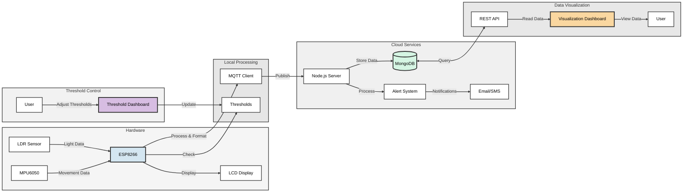
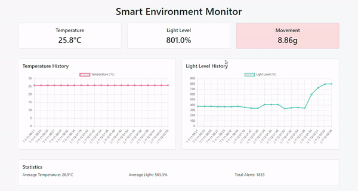
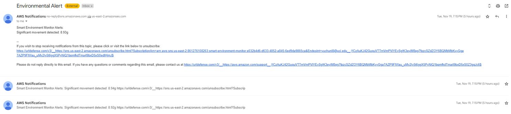
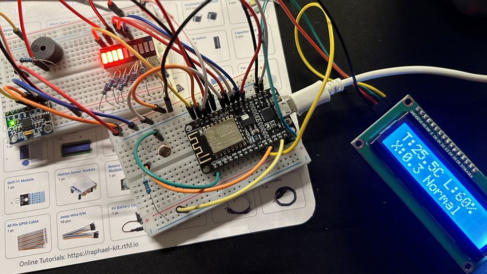
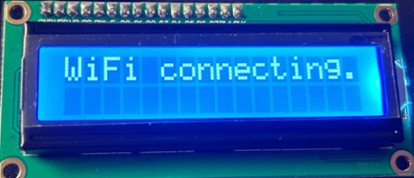
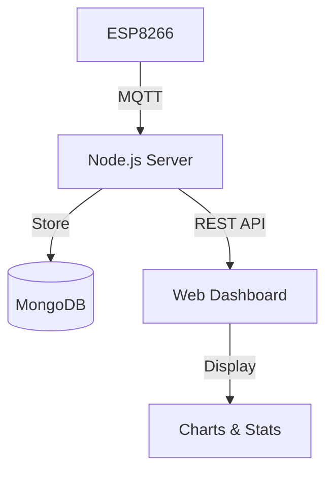

# Smart Environment Monitor

[](https://nodejs.org/)
[](https://www.mongodb.com/)
[](https://www.espressif.com/)
[](https://aws.amazon.com/iot-core/)
[](https://aws.amazon.com/sns/)
[](https://aws.amazon.com/lambda/)

> A professional IoT solution for real-time environmental monitoring, featuring multi-sensor data collection, instant alerts, and comprehensive data visualization through a modern web dashboard.

## 🏗 System Architecture


## System Demo
<div align="center">
  
</div>

## 📑 Table of Contents
- [Overview](#-overview)
- [Application Scenarios](#-application-scenarios)
- [Features](#-features)
- [System Architecture](#-system-architecture)
- [Technical Implementation](#-technical-implementation)
- [Getting Started](#-getting-started)
- [AWS Integration](#-aws-integration)
- [Development](#-development)
- [Contributing](#-contributing)
- [License](#-license)
- [Acknowledgments](#-acknowledgments)

## 🔍 Overview

Smart Environment Monitor is an enterprise-grade IoT system that combines hardware sensors, cloud connectivity, and data analytics to provide comprehensive environmental monitoring. The system utilizes ESP8266 microcontrollers and various sensors to capture real-time environmental data, process it through a robust backend infrastructure, and present actionable insights through an intuitive web interface.

### Key Capabilities
- Real-time environmental data monitoring
- Instant alert notifications
- Historical data analysis
- Cloud-based data storage
- Mobile-responsive dashboard

## 🎯 Application Scenarios

<div align="center">
  <table>
    <tr>
      <td align="center">
        <br/>
        <b>Smart Agriculture</b><br/>
        Optimize crop growth with automated climate control
      </td>
      <td align="center">
        <br/>
        <b>Industrial</b><br/>
        Monitor inventory conditions & security
      </td>
      <td align="center">
        <br/>
        <b>Data Centers</b><br/>
        Protect IT equipment & optimize power
      </td>
    </tr>
    <tr>
      <td align="center">
        <br/>
        <b>Laboratory</b><br/>
        Maintain precise research conditions
      </td>
      <td align="center">
        <br/>
        <b>Smart Buildings</b><br/>
        Enhance comfort & energy efficiency
      </td>
      <td align="center">
        <br/>
        <b>Cold Chain</b><br/>
        Track conditions during transport
      </td>
    </tr>
  </table>
</div>

### Key Benefits
- 🌡️ 24/7 Environmental Monitoring
- ⚡ Real-time Alerts & Response
- 📊 Data Analytics & Reporting
- 🔐 Compliance & Documentation
- ⚙️ Automation & Integration

## ⭐ Features

- **Multi-Sensor Integration**
  - LCD Display
  - Ambient Light (LDR)
  - Motion Detection (MPU6050)
  - Visual & Audio Alerts

- **Advanced Data Processing**
  - Real-time data analysis
  - Customizable alert thresholds
  - Historical trend analysis
  - Data export capabilities

- **Robust Architecture**
  - MQTT-based communication
  - REST API endpoints
  - MongoDB data storage
  - AWS IoT Core integration

- **Security & Reliability**
  - Automated data backup
  - Error handling & recovery
  - Comprehensive logging


## 🛠 Technical Implementation

### Hardware Configuration
| Component | Connection | Purpose |
|-----------|------------|----------|
| DHT11 | GPIO4 (D2) | Temperature & Humidity |
| LDR | ADC (A0) | Light Level |
| MPU6050 | I2C (D1/D2) | Movement Detection |
| LED | GPIO12 (D6) | Visual Alerts |
| Buzzer | GPIO14 (D5) | Audio Alerts |

### Software Stack
- **Backend**: Node.js, Express.js, MongoDB
- **Frontend**: HTML5, JavaScript, Chart.js
- **IoT**: MQTT, AWS IoT Core
- **DevOps**: Docker, PM2

## 🚀 Getting Started

### Prerequisites
- Node.js ≥ 14.0.0
- MongoDB ≥ 4.4
- Arduino IDE with ESP8266 support
- AWS Account (optional)

### Quick Start
1. Clone the repository
2. Configure environment variables
3. Install dependencies
4. Deploy hardware components
5. Start the application

Detailed setup instructions available in our [Development Guide](docs/development.md).

## AWS Integration

### AWS Services Used
- **AWS IoT Core**: For secure MQTT communication
- **AWS SNS**: For alert notifications
- **AWS DynamoDB** (Optional): For data storage

### Setup Instructions

1. **AWS IoT Core Setup**
   - Create a Thing in AWS IoT Core
   - Download certificates (cert.pem, private.key, public.key)
   - Place certificates in `certs/` directory
   - Rename certificates to match config:
     - `Monitor.cert.pem`
     - `Monitor.private.key`
     - `Monitor.public.key`
     - `root-CA.crt`

2. **AWS SNS Setup**
   - Create an SNS topic
   - Create a subscription (email, SMS, etc.)
   - Note down the Topic ARN

3. **Configuration**
   - Copy `config/aws-config.template.js` to `config/aws-config.js`
   - Update with your AWS details:
     ```javascript
     {
         region: 'YOUR_AWS_REGION',
         iot: {
             endpoint: 'YOUR_IOT_ENDPOINT',
             // other IoT settings...
         },
         sns: {
             topicArn: 'YOUR_SNS_TOPIC_ARN',
             accessKeyId: 'YOUR_ACCESS_KEY_ID',
             secretAccessKey: 'YOUR_SECRET_ACCESS_KEY'
         }
     }
     ```

4. **IAM Setup**
   - Create an IAM policy for IoT Core access
   - Attach policy to your certificates
   - Required permissions:
     - `iot:Connect`
     - `iot:Publish`
     - `iot:Subscribe`
     - `iot:Receive`

### AWS SNS Example
<div align="center">
  
</div>


## Acknowledgments
- MQTT Broker: test.mosquitto.org
- Chart.js for data visualization
- Bootstrap for UI components
- ESP8266 Community


### Hardware Components
- ESP8266 NodeMCU
- DHT11 Temperature & Humidity Sensor
- Light Dependent Resistor (LDR)
- MPU6050 Accelerometer
- LED for visual alerts
- Buzzer for audio alerts
- 
<div align="center" style="display: flex; justify-content: center; gap: 20px;">
  
  
</div>

### Data Flow

