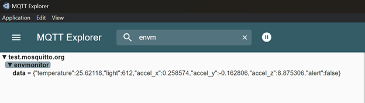
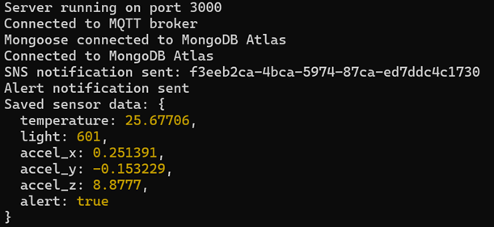
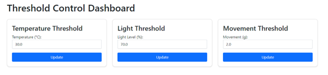

# Smart Environment Monitor

[](https://nodejs.org/)
[](https://www.mongodb.com/)
[](https://www.espressif.com/)
[](https://aws.amazon.com/iot-core/)
[](https://aws.amazon.com/sns/)
[](https://aws.amazon.com/lambda/)

> A professional IoT solution for real-time environmental monitoring, featuring multi-sensor data collection, instant alerts, and comprehensive data visualization through a modern web dashboard.

## 📑 Table of Contents
- [Overview](#-overview)
- [Features](#-features)
- [System Architecture](#-system-architecture)
- [Technical Implementation](#-technical-implementation)
- [Getting Started](#-getting-started)
- [AWS Integration](#-aws-integration)
- [Demo Showcase](#-demo-showcase)
- [Acknowledgments](#acknowledgments)

## 🔍 Overview

Smart Environment Monitor is an enterprise-grade IoT system that combines hardware sensors, cloud connectivity, and data analytics to provide comprehensive environmental monitoring. The system utilizes ESP8266 microcontrollers and various sensors to capture real-time environmental data, process it through a robust backend infrastructure, and present actionable insights through an intuitive web interface.

### Key Capabilities
- Real-time environmental data monitoring
- Instant alert notifications
- Historical data analysis
- Cloud-based data storage
- Mobile-responsive dashboard

## ⭐ Features

### Hardware Integration
- LCD Display for real-time readings
- Ambient Light (LDR) sensing
- Motion Detection (MPU6050)
- Visual & Audio Alerts

### Software Capabilities
- Real-time data analysis
- Customizable alert thresholds
- Historical trend analysis
- Data export functionality

### System Features
- MQTT-based communication
- REST API endpoints
- MongoDB data storage
- AWS IoT Core integration

### Security & Reliability
- Automated data backup
- Error handling & recovery
- Comprehensive logging
- Access control

## 🏗 System Architecture


## System Demo
<div align="center">
  
</div>

## 📑 Table of Contents
- [Overview](#-overview)
- [Application Scenarios](#-application-scenarios)
- [Features](#-features)
- [System Architecture](#-system-architecture)
- [Technical Implementation](#-technical-implementation)
- [Getting Started](#-getting-started)
- [AWS Integration](#-aws-integration)
- [Development](#-development)
- [License](#-license)
- [Acknowledgments](#-acknowledgments)

## 🔍 Overview

Smart Environment Monitor is an enterprise-grade IoT system that combines hardware sensors, cloud connectivity, and data analytics to provide comprehensive environmental monitoring. The system utilizes ESP8266 microcontrollers and various sensors to capture real-time environmental data, process it through a robust backend infrastructure, and present actionable insights through an intuitive web interface.

### Key Capabilities
- Real-time environmental data monitoring
- Instant alert notifications
- Historical data analysis
- Cloud-based data storage
- Mobile-responsive dashboard

## 🎯 Application Scenarios

<div align="center">
  <table>
    <tr>
      <td align="center">
        <br/>
        <b>Smart Agriculture</b><br/>
        Optimize crop growth with automated climate control
      </td>
      <td align="center">
        <br/>
        <b>Industrial</b><br/>
        Monitor inventory conditions & security
      </td>
      <td align="center">
        <br/>
        <b>Data Centers</b><br/>
        Protect IT equipment & optimize power
      </td>
    </tr>
    <tr>
      <td align="center">
        <br/>
        <b>Laboratory</b><br/>
        Maintain precise research conditions
      </td>
      <td align="center">
        <br/>
        <b>Smart Buildings</b><br/>
        Enhance comfort & energy efficiency
      </td>
      <td align="center">
        <br/>
        <b>Cold Chain</b><br/>
        Track conditions during transport
      </td>
    </tr>
  </table>
</div>

### Key Benefits
- 🌡️ 24/7 Environmental Monitoring
- ⚡ Real-time Alerts & Response
- 📊 Data Analytics & Reporting
- 🔐 Compliance & Documentation
- ⚙️ Automation & Integration

## 🛠 Technical Implementation

### Hardware Configuration
| Component | Connection | Purpose |
|-----------|------------|----------|
| DHT11 | GPIO4 (D2) | Temperature & Humidity |
| LDR | ADC (A0) | Light Level |
| MPU6050 | I2C (D1/D2) | Movement Detection |
| LED | GPIO12 (D6) | Visual Alerts |
| Buzzer | GPIO14 (D5) | Audio Alerts |

### Communication Layer (MQTT)

The MQTT protocol enables real-time communication between IoT devices and the server.

#### Broker & Topics
- **Broker**: test.mosquitto.org (Public MQTT Broker)
- **Topic Structure**:
  ```plaintext
  envmonitor/
  ├── data           # Real-time sensor readings
  ├── alerts         # System alerts and notifications
  └── device/status  # Device health monitoring
  ```

#### Implementation Details
- Node.js MQTT client (v4.3.7) for server
- PubSubClient for ESP8266
- Real-time data transmission
- Automatic connection recovery

<div align="center">
  
  <p><em>MQTT Communication Demo</em></p>
</div>

### Data Layer (MongoDB)

MongoDB manages our data persistence with optimized storage and retrieval capabilities.

#### Database Structure
```plaintext
smart_environment_db/
├── sensor_data/  # Environmental measurements
├── alerts/       # Alert records
├── device_logs/  # System operation logs
└── thresholds/   # Alert threshold configurations
```

#### Key Features
- Time-series optimization
- Automated data archiving
- Optimized indexing
- Advanced aggregation

### Application Server (Node.js)

Our Express.js server handles API requests and business logic with robust security measures.

#### Core Features
- RESTful API endpoints
- Real-time WebSocket support
- JWT authentication
- Rate limiting & CORS protection

<div align="center">
  
  <p><em>Data Retrieval Demo</em></p>
</div>

#### API Endpoints
```plaintext
Endpoint                 Method  Description
────────────────────────────────────────────────────────
/api/v1/data            GET     Fetch sensor readings
/api/v1/threshold       POST    Modify alert thresholds
/api/v1/alerts          GET     Retrieve alert history
/api/v1/device          POST    Update device settings
```

## 🚀 Getting Started

### Prerequisites
- Node.js ≥ 14.0.0
- MongoDB ≥ 4.4
- Arduino IDE with ESP8266 support
- AWS Account (optional)

### Quick Start
1. Clone the repository
2. Configure environment variables
3. Install dependencies
4. Deploy hardware components
5. Start the application

## 🌩 AWS Integration

### AWS Services Used
- **AWS IoT Core**: For secure MQTT communication
- **AWS SNS**: For alert notifications
- **AWS DynamoDB**: For data storage (optional)

### AWS SNS Example
<div align="center">
  
  <p><em>AWS SNS Integration Demo</em></p>
</div>

## 📸 Demo Showcase

### Hardware Setup
<div align="center" style="display: flex; justify-content: center; gap: 20px;">
  
  
</div>
<p align="center"><em>ESP8266 Hardware Setup and WiFi Connection</em></p>

### Threshold Management
<div align="center">
  
  <p><em>Threshold Adjustment Dashboard</em></p>
</div>

## Acknowledgments
- MQTT Broker: test.mosquitto.org
- Chart.js for data visualization
- Bootstrap for UI components
- ESP8266 Community
