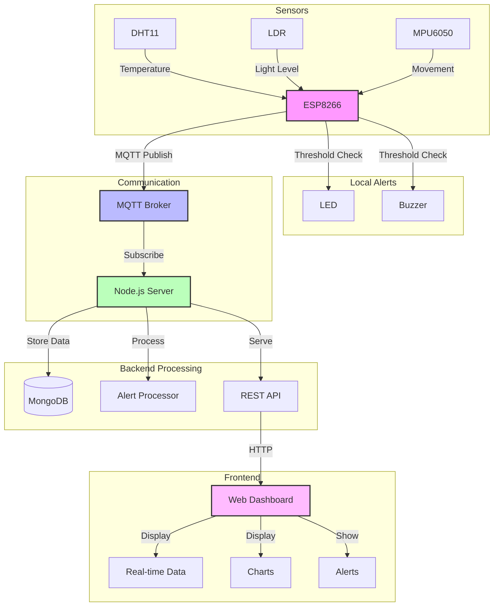
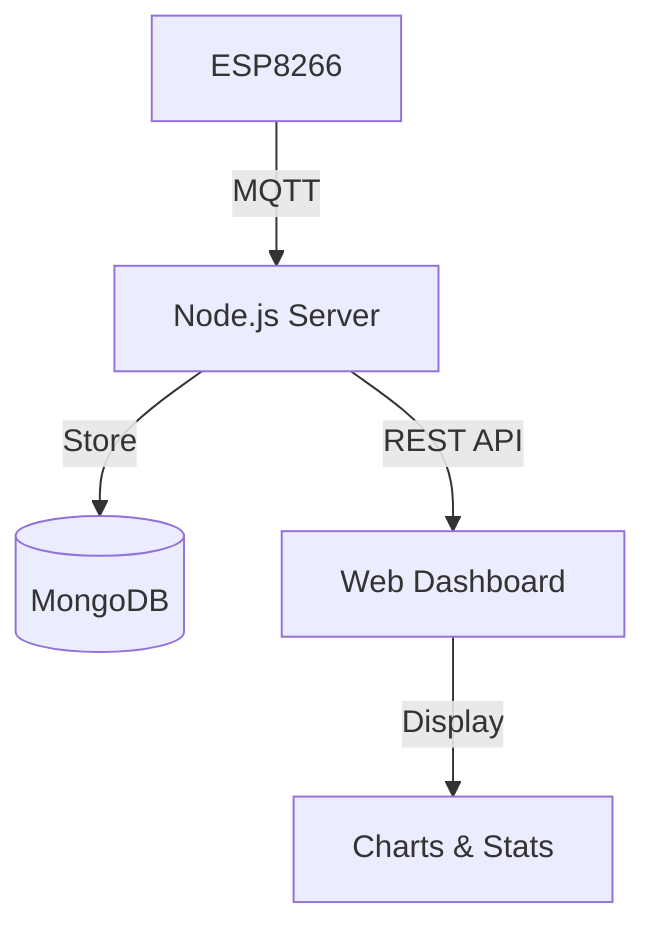

# Smart Environment Monitor

A real-time environmental monitoring system that integrates ESP8266 with multiple sensors to create a comprehensive monitoring solution. The system captures temperature, light levels, and movement data, providing instant alerts and historical data visualization through a web-based dashboard.

## System Overview

### Components
- **Hardware**: ESP8266 NodeMCU, DHT11, LDR, MPU6050, LED, Buzzer
- **Backend**: Node.js, Express.js, MongoDB, MQTT Broker
- **Frontend**: HTML5, JavaScript, Chart.js
- **Communication**: MQTT Protocol

### System Flow Chart


### Data Processing Flow
1. **Sensor Reading**
   ```
   Sensors → ESP8266 → Data Formatting → Threshold Check
   ```

2. **Alert Processing**
   ```
   Threshold Check → Local Alerts (LED/Buzzer)
                  → MQTT Alert Message
                  → Dashboard Notification
   ```

3. **Data Storage & Retrieval**
   ```
   MQTT → Node.js → MongoDB ← REST API ← Dashboard
   ```

## Project Demo

### Hardware Setup

*ESP8266 connected with sensors*

### Web Dashboard

*Real-time monitoring dashboard*

### Alert System

*Alert system in action*

## Technical Implementation

### Hardware Configuration
Connect the sensors to ESP8266:
- DHT11 → GPIO4 (D2)
- LDR → ADC (A0)
- MPU6050 → I2C (D1/D2)
- LED → GPIO12 (D6)
- Buzzer → GPIO14 (D5)

### Software Architecture
```
Device Layer (Arduino/C++)
├── Sensor Integration
│   └── Temperature, Light, Movement monitoring
├── Alert System
│   └── LED and Buzzer control
└── MQTT Communication

Server Layer (Node.js)
├── MQTT Broker
├── MongoDB Database
└── REST API Endpoints
    ├── /api/data/latest
    ├── /api/data/range
    ├── /api/alerts
    └── /api/stats

Client Layer (Web Dashboard)
├── Real-time Display
└── Data Visualization
```

### Alert Thresholds
- Temperature: >30°C
- Light Level: >70%
- Movement: >2.0g acceleration

## Setup Guide

### Prerequisites
- Node.js (v14+)
- MongoDB (v4.4+)
- Arduino IDE with ESP8266 board support

### Quick Start
1. Clone the repository
2. Install dependencies
3. Configure environment variables
4. Upload firmware to ESP8266
5. Start the server
6. Access dashboard at http://localhost:3000

For detailed setup instructions and API documentation, see the [Development Guide](./docs/development.md).

## AWS Integration

### AWS Services Used
- **AWS IoT Core**: For secure MQTT communication
- **AWS SNS**: For alert notifications
- **AWS DynamoDB** (Optional): For data storage

### Setup Instructions

1. **AWS IoT Core Setup**
   - Create a Thing in AWS IoT Core
   - Download certificates (cert.pem, private.key, public.key)
   - Place certificates in `certs/` directory
   - Rename certificates to match config:
     - `Monitor.cert.pem`
     - `Monitor.private.key`
     - `Monitor.public.key`
     - `root-CA.crt`

2. **AWS SNS Setup**
   - Create an SNS topic
   - Create a subscription (email, SMS, etc.)
   - Note down the Topic ARN

3. **Configuration**
   - Copy `config/aws-config.template.js` to `config/aws-config.js`
   - Update with your AWS details:
     ```javascript
     {
         region: 'YOUR_AWS_REGION',
         iot: {
             endpoint: 'YOUR_IOT_ENDPOINT',
             // other IoT settings...
         },
         sns: {
             topicArn: 'YOUR_SNS_TOPIC_ARN',
             accessKeyId: 'YOUR_ACCESS_KEY_ID',
             secretAccessKey: 'YOUR_SECRET_ACCESS_KEY'
         }
     }
     ```

4. **IAM Setup**
   - Create an IAM policy for IoT Core access
   - Attach policy to your certificates
   - Required permissions:
     - `iot:Connect`
     - `iot:Publish`
     - `iot:Subscribe`
     - `iot:Receive`

### Security Notes
- Never commit AWS credentials to GitHub
- Keep certificates secure
- Use environment variables for sensitive data
- Follow AWS security best practices

## Contributing
1. Fork the repository
2. Create your feature branch
3. Commit your changes
4. Push to the branch
5. Create a Pull Request

## License
This project is licensed under the MIT License - see the LICENSE file for details.

## Acknowledgments
- MQTT Broker: test.mosquitto.org
- Chart.js for data visualization
- Bootstrap for UI components

## System Architecture

### Hardware Components
- ESP8266 NodeMCU
- DHT11 Temperature & Humidity Sensor
- Light Dependent Resistor (LDR)
- MPU6050 Accelerometer
- LED for visual alerts
- Buzzer for audio alerts

### Software Components
1. **Device Layer**
   ```
   ESP8266 Firmware
   ├── Sensor Readings
   │   ├── Temperature & Humidity (DHT11)
   │   ├── Light Level (LDR)
   │   └── Movement (MPU6050)
   ├── Alert System
   │   ├── LED Control
   │   └── Buzzer Control
   └── MQTT Client
       └── Data Publishing
   ```

2. **Server Layer**
   ```
   Node.js Server
   ├── MQTT Broker
   │   ├── Topic: envmonitor/data
   │   └── Topic: envmonitor/alerts
   ├── MongoDB Database
   │   ├── Sensor Readings Collection
   │   └── Alerts Collection
   └── REST API
       ├── /api/data/latest
       ├── /api/data/range
       ├── /api/alerts
       └── /api/stats
   ```

3. **Client Layer**
   ```
   Web Dashboard
   ├── Real-time Display
   │   ├── Current Sensor Values
   │   └── Active Alerts
   ├── Historical Data
   │   ├── Temperature Chart
   │   ├── Light Level Chart
   │   └── Movement Chart
   └── Statistics Panel
       └── Min/Max/Avg Values
```

### Data Flow


### Alert System
```javascript
// Device-side (ESP8266)
if (sensorValue > threshold) {
    triggerLocalAlert();  // LED + Buzzer
    publishAlert();       // MQTT Alert
}

// Server-side
mqtt.on('alert', (message) => {
    io.emit('alert', message);  // WebSocket to dashboard
});

// Dashboard-side
socket.on('alert', (message) => {
    showNotification(message);
});
```

## Technical Skills Demonstrated
1. **IoT Development**
   - Sensor integration and calibration
   - Real-time data acquisition
   - MQTT protocol implementation
   - Embedded systems programming

2. **Full-Stack Development**
   - RESTful API design
   - Frontend development with React
   - Backend development with Node.js
   - Database design and management

3. **Data Analysis**
   - Real-time data processing
   - Data visualization

## Key Features
- Multi-sensor environmental monitoring (Temperature, Light, Movement)
- Real-time data processing and visualization
- MQTT-based communication protocol
- Web-based dashboard with responsive design
- Local alerts (LED and Buzzer)
- Data logging and historical analysis

## Technologies Used
- **Hardware**: ESP8266, DHT11, LDR, MPU6050 sensors
- **Backend**: Node.js, Express.js, MongoDB
- **Frontend**: HTML5, CSS, JavaScript, Chart.js
- **IoT Protocol**: MQTT (Mosquitto broker)
